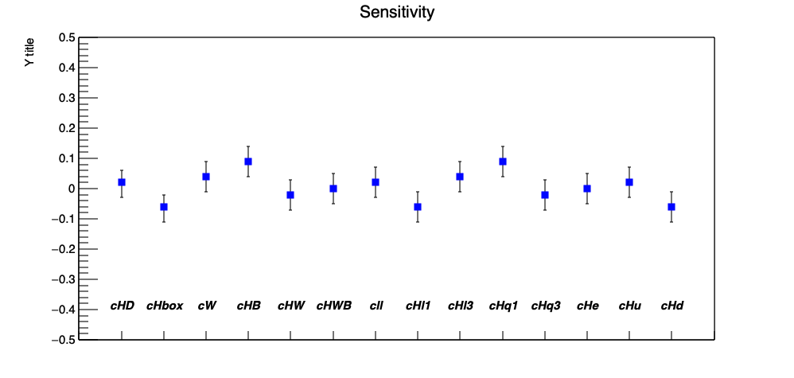

Goal of this is section is to analyse the sensitivity of the theoretical model
to each of the 14 6-dimension operators, VBS WW SS relevant. This is done by
analysing each operator *individually* meaning the other Wilson coefficients are
set to zero. In order to perform the analyses one should provide the distribution
of the observable, a likelihood scan will give an estimate of the parameter(i.e.
the Wilson coefficient of the operator) and the confidence interval. These three
information will be saved in a .txt file for each operator. Finally a graph is
constructed and should(hopefully) look like this:
(data used for this image was randomly generated around zero)
